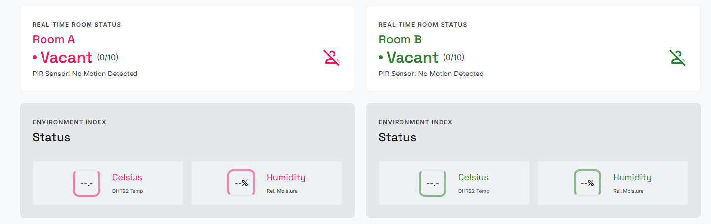
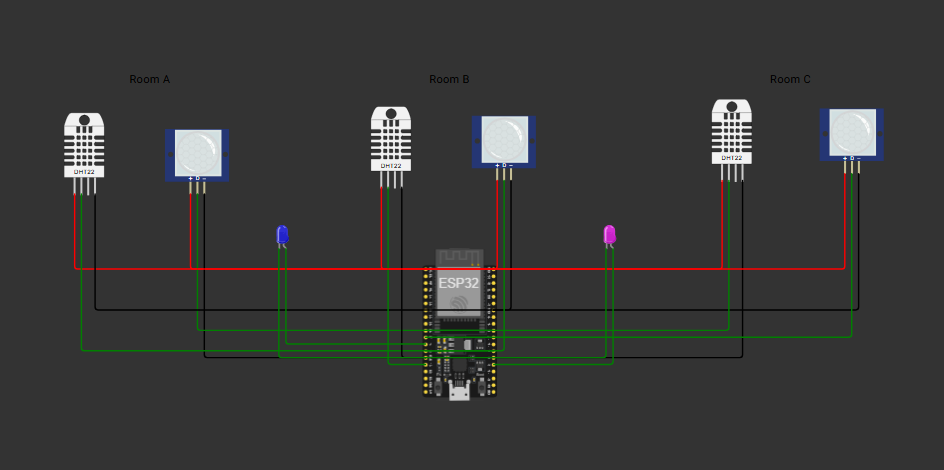

# 🏢 SmartSense Pro | Occupancy & Environment Monitor
**รายวิชา:** CS423 Internet of Things and Applications  
**มหาวิทยาลัยกรุงเทพ**

ระบบตรวจจับความหนาแน่นและสภาพแวดล้อมในห้องประชุมแบบ Real-time เพื่อช่วยบริหารจัดการพื้นที่และประหยัดพลังงานภายในอาคาร Smart Building

---

## 👥 สมาชิกกลุ่ม
1. เกวลิน ปวรรณพงษ์ (1660703321)
2. เจนนิเฟอร์ แอน สไวร์เซอร์ (1660703305)
3. วนิดา เกษียา (1660702869)

---

## 📸 ภาพรวมของระบบ (System Overviews)

### Web Dashboard


*หน้าจอ Dashboard แสดงผลข้อมูลเซนเซอร์และการควบคุมอุปกรณ์แบบ Real-time*

### Hardware Simulation (Wokwi)

*การจำลองการทำงานของ ESP32 พร้อมเซนเซอร์ PIR และ DHT22 บน Wokwi*

---

## 🌟 ฟีเจอร์หลัก (Features)
- **Real-time Monitoring:** แสดงค่าอุณหภูมิและความชื้นจากเซนเซอร์ DHT22
- **Occupancy Detection:** ตรวจจับการเคลื่อนไหวภายในห้องด้วย PIR Sensor และนับจำนวนผู้ใช้งาน
- **Interactive Dashboard:** หน้าจอควบคุมที่ทันสมัย รองรับ Dark/Light Mode และการแจ้งเตือน (Toast Notifications)
- **Hardware Control:** สามารถสั่งเปิด-ปิดพัดลม (Fan) และไฟ (LED) ได้จากหน้าจอ
- **Data Persistence:** บันทึกประวัติข้อมูลเซนเซอร์ลงในฐานข้อมูล SQLite โดยอัตโนมัติ

---

## 🛠️ โครงสร้างระบบ (Platform Stack)
ระบบของเราแบ่งการทำงานออกเป็น 4 ส่วนหลัก ตามมาตรฐาน IoT Architecture:
1. **Device Layer:** ใช้ ESP32 (Wokwi Simulation) เชื่อมต่อกับ PIR และ DHT22
2. **Network Layer:** สื่อสารผ่านโปรโตคอล MQTT (Broker: HiveMQ) และ Wi-Fi
3. **Backend Layer:** พัฒนาด้วย Python Flask ทำหน้าที่รับข้อมูลและจัดการ Database (SQLite)
4. **Application Layer:** Web Dashboard พัฒนาด้วย HTML, Tailwind CSS และ JavaScript

**🤖 AI Agents Integration:** ในโครงงานนี้มีการใช้ ChatGPT, Gemini และ CROSS ในการช่วยออกแบบโครงสร้างฐานข้อมูล, ตรวจสอบความถูกต้องของโค้ด และสรุปเนื้อหาเอกสาร

---

## 🚀 วิธีการติดตั้งและใช้งาน

### 1. การเตรียมระบบ Backend
โปรดติดตั้ง Library ที่จำเป็นก่อนรัน Server:
```bash
pip install flask flask-cors paho-mqtt
